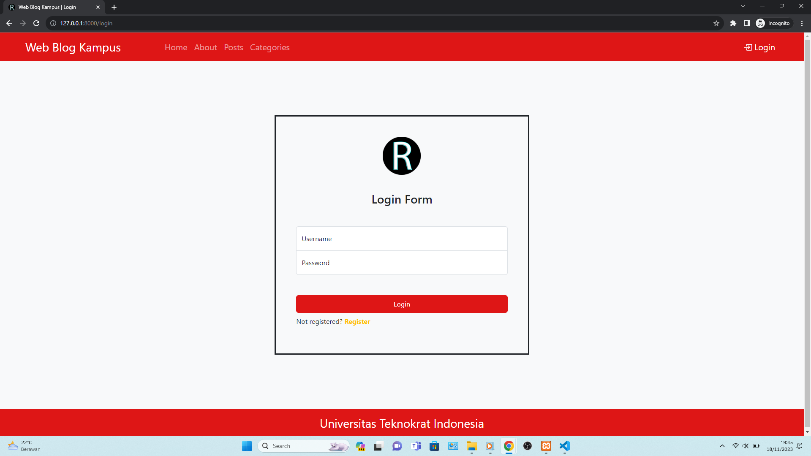
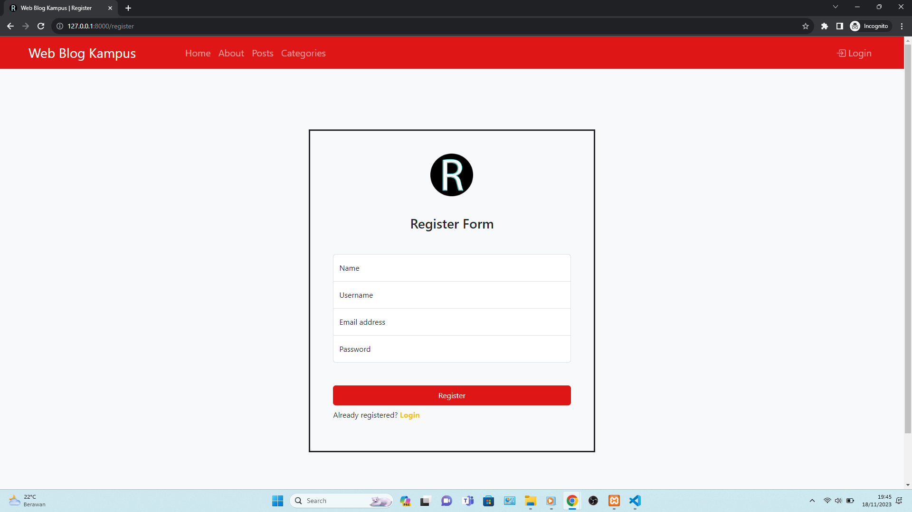
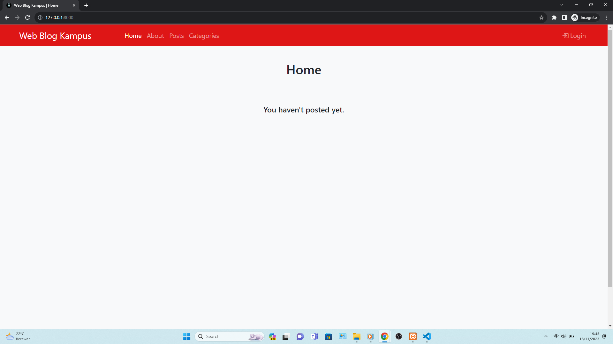
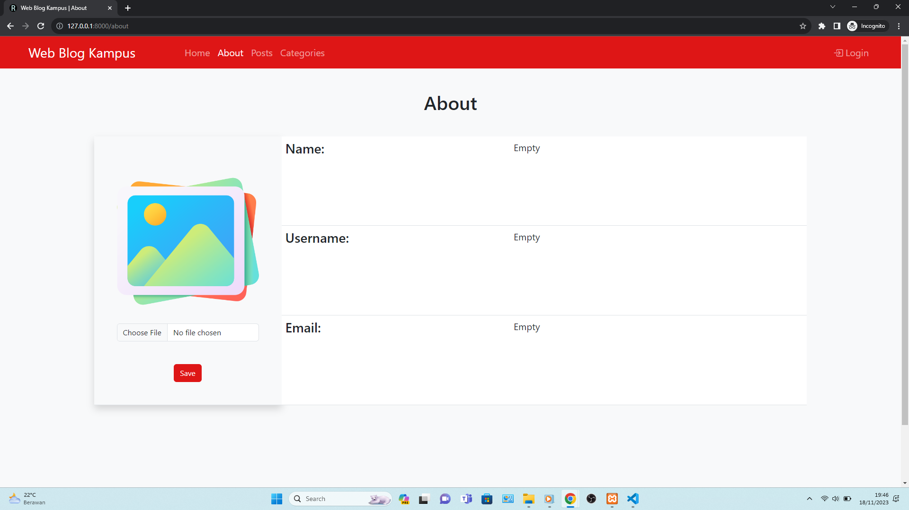
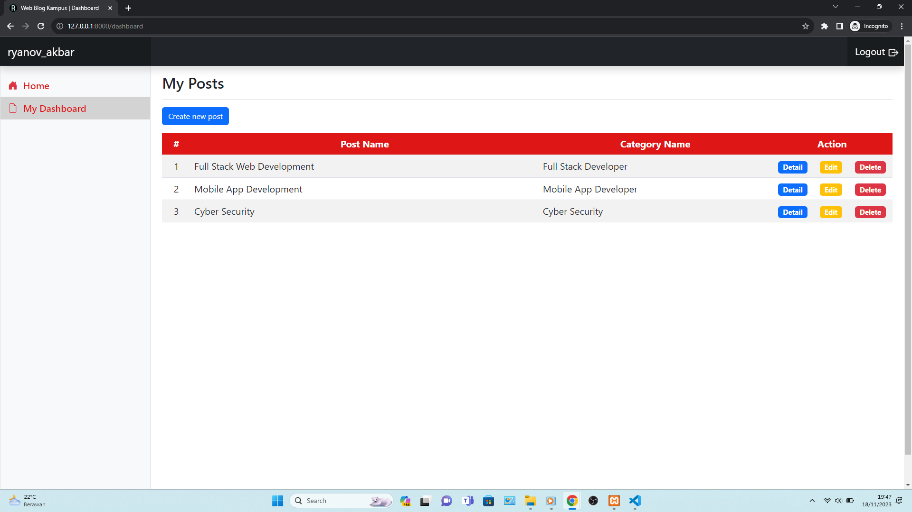

<h1 align="center"><b>Pemrograman Web II</b></h1>

## Kelompok 2 (Content Management System)
* Ryanov Akbar - <b>21312020</b>
* Muhammad Agung Saputra - <b>21312035</b>
* Muhammad Romza Zikrian - <b>21312052</b>

## Tech Stack 

 

 

## Website Documentation 

## System Requirements
* HTML5
* CSS3
* JavaScript (ECMAScript 2023)
* Apache 2.4.56
* MySQL 10.4.28
* PHP 8.2.4
* Laravel 10.31.0
* Bootstrap 5.3
* jQuery 3.7.0
* Popper 2.11.8

## Feature List
#### (RESTful API)
* [Create]: Create a Post and Create a Category for Posts 
* [Read]: Read a Post and Read a Category for Posts 
* [Update]: Update a Post and Update a Category for Posts 
* [Delete]: Delete a Post and Delete a Category for Posts 

## Contributor
* Full-Stack: Ryanov Akbar
* Figma Design: Muhammad Agung Saputra
* QA Tester: Muhammad Romza Zikrian